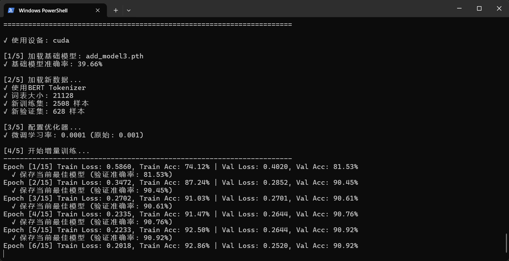
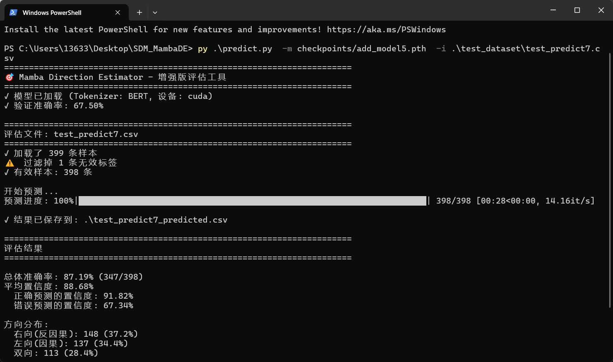

# Smart Direction Mamba (SDM)

## Smart Direction Mamba (SDM) Architecture Core Principles

The core objective of the Smart Direction Mamba (SDM) architecture is to dynamically resolve the fixed causality problem faced by the Mamba/SSM architecture when processing natural language, while strictly controlling computational complexity. 

Traditional Mamba has a linear time complexity of O(N), but its fixed, unidirectional scan cannot effectively handle non-causal dependencies that require "future information." While the Transformer can handle non-causality, its O(N^2) complexity is inefficient for long sequences.

Background: Dynamic Directionality

Traditional Mamba has a linear time complexity of O(N), but its fixed, unidirectional scan is fundamentally constrained. This conflicts with the nature of human language: Language is non-causal within local segments (like a phrase or sentence), where understanding may require looking ahead (non-causal dependency); yet, the overall flow of information and narrative structure remains sequential (causal).

While standard Bidirectional Mamba (Bi-Mamba) can address non-causality through two scans (forward + reverse), it falls short as an efficient solution due to two main drawbacks:

1. Computational Redundancy: Bi-Mamba mandatorily performs double the computation for all text, even in sections that are highly causal.
2. Semantic Ambiguity: Forcing bidirectional scanning often introduces unnecessary directional noise, potentially diluting the core semantic meaning.

SDM's Core Advantage: SDM is designed to perfectly fit the "locally non-causal, globally causal" nature of human language. It uses intelligent, on-demand local direction decisions to capture small-segment non-causality while maintaining macro-level causality through Mamba's sequential state propagation. This intelligent approach avoids the computational redundancy inherent in Bi-Mamba, leading to a better balance of efficiency and performance.


SDM's Goal: Utilize the powerful local discrimination ability of Mamba states or Transformer to guide the Mamba scan, achieving both O(N) efficiency and non-causal modeling capabilities. Utilize the powerful local discrimination ability of Mamba states or Transformer to guide the Mamba scan, achieving O(N) efficiency and non-causal modeling capabilities that align with human language processing.

Complexity and Efficiency Control

SDM avoids global quadratic complexity by chunking the computation and restricting the Direction Estimator (DE) calculation to small blocks of length L. The discrimination calculation for the flow direction within all blocks can be executed in parallel.

Complexity Maintenance:
 1. Mamba DE (Option 1) Complexity: If the Direction Estimator uses Mamba/SSM state comparison, its computational complexity is O(L). The overall complexity of the architecture remains approximately O(N * L), maintaining linear efficiency with lower total work.
 2. Transformer DE (Option 2) Complexity: The Transformer's attention computation is strictly limited within the block, with complexity O(L^2). Since L is a preset small constant, the overall complexity of the architecture is still approximately O(N * L^2); the total work is higher, but the time cost is hidden through parallel computation.

Core Mechanism: Direction Estimator (DE)

The DE's role is to determine the optimal scanning direction for each data block.

Option 1: Mamba DE (O(L) Complexity)

The Mamba DE utilizes the linear state compression ability of Mamba/SSM itself for direction judgment and can scan each small block in parallel.
 1. Input and Computation: The DEs for all data blocks simultaneously receive the current block's Token embeddings and execute two independent minimal Mamba scans (Forward H_F and Backward H_B) in parallel.
 2. Feature Extraction: The estimator identifies the dominant information flow trend by comparing the final states of H_F and H_B. This keeps the total computational load linear.

Option 2: Transformer DE (O(L^2) Complexity)
The Transformer DE is a minimalist micro-Transformer.
 1. Input and Computation: The DEs for all datasets receive the current block's Token embeddings and calculate their attention matrix A = QK^T in parallel.
 2. Feature Extraction: The estimator analyzes the A matrix, comparing the sum of weights in the upper triangular region (Tokens relying on the future) and the lower triangular region (Tokens relying on history) to identify the dominant information flow trend.

Decision Output:

A lightweight MLP head converts these features into three Logits (raw scores): Leftward, Rightward, and Bidirectional.

Dynamic Mamba Scan and State Propagation

The Mamba scan switches based on the DE's decision, but its global state propagation (H) remains unidirectionally coherent to ensure continuity across long sequences.

3.1 Dynamic Scanning Modes

1. Forward (L): Mamba executes a standard forward scan to capture causal dependencies.

~~2. Backward (R): Mamba executes a backward scan to capture non-causal dependencies (i.e., local future context).~~

3. Bidirectional (B): Mamba executes two independent scans (forward and backward) and then fuses their outputs to capture the most complex local dependencies.

**Note: Although the Direction Estimator outputs three states (Left, Right, and Bidirectional), the dynamic scanning process only executes two modes: a Forward Scan (for the L state) and a Bidirectional Scan (for both the R and B states). This prevents state incoherence and enhances robustness.**

3.2 Skip Estimator (SE)

In addition to the Direction Estimator (DE), the SDM architecture can incorporate a Skip Estimator (SE) to decide whether to skip the current block by calculating an information increment signal. The core process is as follows: first, the Token embeddings of the current block are Mean Pooled to derive a vector representing the Local Semantic Core; next, this local vector is compared against the previous block's final state, H_end_{t-1} (the Historical Semantic State), to calculate their difference or similarity. If the similarity is high, the block is deemed highly redundant with the historical information, and the SE executes a skip operation, bypassing the computation for the current block.

3.3 State Propagation Mechanism

Regardless of the scan direction used internally by block t, its final state H_end_t is defined as the starting state H_start_{t+1} for the next block t+1. This ensures:
 1. Global History: Even if block t performs a reverse scan internally, it still inherits all historical context by starting with the H_end of block t-1.
 2. Unified Interface: For bidirectional scans, the model designs a fusion layer that merges the final forward and reverse states into a single, unified H_end vector for propagation.

3.4 Parallelization Concept: Synchronous Global Direction Discrimination

Whether using the Mamba DE or the Transformer DE, SDM leverages the independence of the direction discrimination computation to achieve large-scale parallelization:
 1. Independent Computation: The Direction Estimator (DE) for each block depends only on the current block's input Tokens and does not depend on the Mamba state H_end_{t-1} propagated from the previous block.
 2. Synchronous Execution: Therefore, for the entire sequence N, the direction decision for all N/L blocks can be run simultaneously and independently.
 3. Efficiency Guarantee: This ensures that the time cost of the O(N * L) or O(N * L^2) discrimination computation is greatly compressed and hidden by the O(N) sequential Mamba state propagation time. This guarantees that SDM's actual running speed remains dominated by the O(N) serial Mamba scan.

Training Feasibility

SDM relies on the Gumbel-Softmax trick for end-to-end training:
 1. The DE's Logits are converted into a differentiable probability distribution (Leftward, Rightward, Bidirectional).
 2. The Mamba's final output is the weighted average of the scan results from these three directions.
 3. This allows gradients to flow smoothly back to the weights of the Mamba DE or Transformer DE, enabling the entire hybrid architecture to be trained jointly.

Future Scopes:
 1. It could be introduced a Attention Mechanism for Textual Influence Flow, by which the ability to dynamically adjust block size (L), expanding L when the text structure is stable to increase context utilization, and shrinking L when the structure is complex and flow direction is inconsistent to ensure coherence within the block.
 2. The possibility of designing mechanisms to detect redundant sequence blocks and skip the scan operation, passing the historical record from the previous block directly to the subsequent block to continue the scan.
 3. If multiple adjacent chunks share the same direction, they can be fused into a single large chunk for a unified scan, which saves computational resources.
 4. DE-Guided Adaptive Scan Intensity: Utilize the DE's output results, beyond simple direction labels, to dynamically adjust the computational intensity of the forward and backward SSMs within the main Mamba (e.g., through internal state gating or weighted fusion). This could enable finer-grained computational resource optimization compared to the current 'two-state' (binary/on-off) approach. A more robust extension is to use the DE for "soft weighting" instead of "hard routing": a standard Bi-Mamba always computes the forward (Y_f) and backward (Y_b) scans in parallel, while the DE concurrently outputs two dynamic weights (w_f, w_b). The final block output is a weighted mixture: Output = (w_f * Y_f) + (w_b * Y_b). The advantage of this design is its adaptive control, "muting" semantic noise from irrelevant scan directions by adjusting weights (e.g., setting w_b ~= 0 for a forward-heavy block), while also being highly robust, as a DE misprediction only degrades the signal-to-noise ratio rather than causing catastrophic information loss. Critically, this weighting only affects the block's "local output" Y and never interferes with the core Mamba's serial "global history state" h, ensuring global context integrity.
 5. Warm-Starting Main Mamba with DE Internal States: Reuse the final hidden state (h_b_de) generated by the DE's internal (backward) SSM during direction prediction to initialize the main Mamba's backward scan for the corresponding block. This provides a 'warm start', avoiding a cold start from a zero state, potentially accelerating convergence and enhancing the understanding of intra-block backward dependencies.
 6. Chunking by conversation turns leverages their natural semantic boundaries, effectively avoiding the direction misjudgments caused by arbitrary cuts in long sequence analysis.


## Mamba DE Demo User Manual:

## Mamba Direction Estimator Script Usage Instructions

The following are usage instructions for the three core scripts in the project: train.py (from scratch training), train_add.py (incremental training), and predict.py (prediction/evaluation). Each script supports interactive mode (guides input when run without parameters), and uses CSV files as input (must have 'text' column, training/evaluation requires additional 'direction' column with labels left/right/bidirectional). All scripts output models to the checkpoints/ directory and prediction results to CSV files in the current directory.

train.py - From Scratch Training Script

This script is used to train the model from scratch, supporting automatic merging of single or multiple CSV datasets. Suitable for initial training or retraining when data changes significantly.

### Basic Usage:

Interactive: python train.py (the system will ask for files and parameters step by step).

```bash
Command Line: python train.py -i training_data.csv --auto (quick training with default configuration).
```

### Example:

Assume you have training_data.csv (100 samples), want to train for 50 epochs, batch size 32, learning rate 0.0005, save as my_model:
```bash
python train.py -i training_data.csv --batch-size 32 --epochs 50 --lr 0.0005 --model-name my_model
```
Output: checkpoints/my_model.pth (model file) and merged_dataset.csv (if multiple files were merged).

### Parameter Description:

-i, --input: Input CSV file path, can be multiple (e.g., -i data1.csv data2.csv), default interactive selection, required.

--batch-size: Batch size, default 16, example 32 (larger makes training more stable, but requires more memory).

--epochs: Number of training epochs, default 30, example 50 (too many may lead to overfitting).

--lr: Learning rate, default 0.001, example 0.0005 (too high may cause oscillation, too low slows convergence).

--model-name: Model save name, default best_model, example my_model.

--auto: Use default configuration to skip interaction, default no.

## train_add.py - Incremental Training Script

This script fine-tunes on an existing model, continuing training with new data, with learning rate automatically reduced to 10% of original to prevent forgetting old knowledge. Suitable for optimizing with small amounts of new data.

### Basic Usage:
```
Interactive: python train_add.py -i new_data.csv (guides selection of model and new data).

Command Line: python train_add.py -m checkpoints/best_model.pth -i new_data.csv --epochs 10.
```
### Example:

Assume you have checkpoints/v1.pth, use new_data.csv (20 new samples) to fine-tune for 10 epochs, batch 16, save as v2:
```
python train_add.py -m checkpoints/v1.pth -i new_data.csv --batch-size 16 --epochs 10 --model-name v2
```
Output: checkpoints/v2.pth (fine-tuned model) and console report (shows accuracy improvement, e.g., +5%).

### Parameter Description:

-m, --model: Base model path, default interactive selection, required, example checkpoints/v1.pth.

-i, --input: New data CSV path, default interactive selection, required, example new_data.csv.

--batch-size: Batch size, default 16, example 32.

--epochs: Number of training epochs, default 10, example 15 (recommended fewer than full training to avoid overfitting).

--lr: Learning rate, default 0.001 (automatically *0.1), example 0.001 (actual 0.0001).

--model-name: Save name, default fine_tuned_model, example v2.

## predict.py - Prediction/Evaluation Script

This script is used to test the model (calculates accuracy with labeled data) or predict new data (outputs direction and confidence without labels). Supports interactive single-text testing.

### Basic Usage:
```
Interactive: python predict.py (guides selection of model and file).

Command Line: python predict.py -m checkpoints/best_model.pth -i test_data.csv (evaluate with labels).
```
### Example:

Assume using checkpoints/my_model.pth to predict test_data.csv (no labels), output to results/:
```
python predict.py -m checkpoints/my_model.pth -i test_data.csv -o results/ --interactive (interactive mode allows single-text input testing).
```
Output: test_predicted.csv (columns: text, pred_label, pred_label_cn, confidence, prob_left, prob_right, prob_bidirectional; with labels adds true_label, correct).

### Parameter Description:

-m, --model: Model path, default interactive selection, required, example checkpoints/best_model.pth.

-i, --input: Input CSV path, can be multiple, default interactive selection, required, example test_data.csv.

-o, --output-dir: Output directory, default current directory, example results/.

-t, --text-col: Text column name, default text, example content.

-l, --label-col: Label column name, default direction, example label (ignored without labels).

--interactive: Enable interactive single-text prediction, default no.

### Quick Workflow Example:

Training: python train.py -i training_data.csv --model-name v1

Incremental: python train_add.py -m checkpoints/v1.pth -i new_data.csv --model-name v2

Prediction: python predict.py -m checkpoints/v2.pth -i test.csv

Note: Ensure PyTorch/GPU environment, data UTF-8 encoding. If accuracy is low, check data balance or add epochs.






# Smart Direction Mamba (SDM) 架构核心原理

## Smart Direction Mamba (SDM) 的核心目标是动态解决 Mamba/SSM 架构在处理自然语言时面临的固定因果性问题，同时严格控制计算复杂度。 传统 Mamba 具有线性时间复杂度 O(N)，但其固定的单向扫描无法有效处理需要“未来信息”的非因果依赖。Transformer 虽然能处理非因果性，但其 O(N^2) 的复杂度在长序列上效率低下。

SDM 的目标： 利用 Mamba 状态或 Transformer 强大的局部判别力来指导 Mamba 的扫描，实现 O(N) 的效率和非因果的建模能力。利用 Mamba 状态或 Transformer 强大的局部判别力来指导 Mamba 的扫描，实现 O(N) 的效率和符合人类语言处理习惯的非因果建模能力。

背景：动态方向控制

传统 Mamba 具有线性时间复杂度 O(N)，但其固定的单向扫描存在根本性约束。这与人类语言的特征不符：人类语言在局部小段落内（例如一个短语或句子）是非顺序的，理解信息可能需要查看后续内容（非因果依赖）；但在宏观上，信息流动的整体逻辑和叙事结构是顺序的（因果依赖，即从历史到未来）。

虽然标准双向 Mamba (Bi-Mamba) 可以通过两次扫描来处理非因果性，但它存在两大缺点，使其不适合作为高效的替代方案：
1. 计算冗余： Bi-Mamba 对所有文本都强制执行双倍计算，即使在高度因果的段落中也是如此。
2. 语义模糊： 强制的双向扫描，在大部分情况下会引入不必要的方向性噪声，反而可能稀释核心语义。
SDM 的核心优势： SDM 的设计正是为了完美契合人类语言的“局部非顺序，总体顺序”特征。它通过动态、按需的局部方向决策来捕捉小段落的非因果性，同时通过保持 Mamba 状态的单向传递来维护宏观的因果性。这种智能决策避免了 Bi-Mamba 固有的计算冗余，实现了效率和性能的最佳平衡。

复杂度与效率

SDM 通过对计算进行分块，将 方向判别器 (DE) 的计算限制在长度为 L 的小块内，所有块内的影响流向的判别计算都能够并行执行：

复杂度保持：

1. Mamba DE (可选方案一) 复杂度： 若方向判别器采用 Mamba/SSM 状态比较，其计算复杂度为 O(L)。架构的总体复杂度仍近似为 O(N * L)，保持了线性效率，且总工作量更低。
2. Transformer DE (可选方案二) 复杂度： Transformer 的注意力计算被严格限制在块内，复杂度为 O(L^2)。由于 L 是一个预设的小常数，架构的总体复杂度仍近似为 O(N * L^2)，总工作量更高，但通过并行计算隐藏了时间成本。

核心机制：方向判别器 (Direction Estimator, DE)

DE 的作用是为一个数据块决定最优的扫描方向。

可选方案一：Mamba DE (O(L) 复杂度)

Mamba DE 利用 Mamba/SSM 自身的线性状态压缩能力进行方向判断，并且能够并行扫描每个小块。
1.输入与计算： 所有数据块的DE 同时接收当前数据块的 Token 嵌入，并行执行两次独立的最小 Mamba 扫描（正向 H_F 和反向 H_B）。
2.特征提取： 判别器通过比较 H_F 和 H_B 的最终状态，识别信息流的主导趋势。这使得 总计算量保持线性。

可选方案二：Transformer DE (O(L^2) 复杂度)

Transformer DE 是一个极简的微型 Transformer。
1.输入与计算： 所有数据集DE 接收当前数据块的 Token 嵌入，并行计算其注意力矩阵 A = QK^T。
2.特征提取： 判别器分析 A 矩阵，比较上三角区域（Token 依赖未来）和下三角区域（Token 依赖历史）的权重之和，从而识别信息流的主导趋势。

决策输出：

一个轻量的 MLP 决策头将这些特征转化为三个 Logits（原始分数）：左向、右向、双向。
动态 Mamba 扫描与状态传递

Mamba 扫描根据 DE 的决策进行切换，但其全局状态传递 (H) 保持单向连贯，以确保长序列的连续性。

3.1 动态扫描模式
1. 左向（L）： Mamba 执行标准的前向扫描，用于捕获因果关系。

~~2. 右向（R）： Mamba 执行反向扫描，用于捕获非因果关系（即局部未来上下文）。~~

3. 双向（B）： Mamba 执行两次独立的扫描（正向和反向），然后融合它们的输出，以捕获最复杂的局部依赖。

**注意，方向判别器虽然会输出三种状态（左，右，双向），但是动态扫描只进行正向扫描（L）和双向扫描（R和B），防止出现混乱，增强鲁棒性。**
 
3.2 跳过判别器（SE）

SDM 架构中除了可以使用DE，还可以引入跳过判别器（SE），通过计算信息增量信号来决定是否跳过当前块。该过程的核心是：首先，对当前块的 Token 嵌入进行 平均池化，得到一个局部语义核心向量；随后，计算这个局部向量与前一个块的最终状态 H_end_{t-1}（即历史语义状态）之间的差异度或相似度。如果相似度高，则代表当前块与历史信息高度冗余，SE 会执行跳过操作，无需计算当前块。

3.3 状态传递机制

无论块 t 内部采用何种扫描方向，其最终状态 H_end_t 都被定义为下一个块 t+1 的起始状态 H_start_t+1。这保证了：
1. 全局历史： 即使块 t 内部是反向扫描，它仍然以 t-1 块的 H_end 作为起点，继承了所有历史上下文。
2. 统一接口： 针对双向扫描，模型会设计一个融合层，将正向和反向的最终状态合成为一个统一的 H_end 向量进行传递。

并行化理念：同步进行全局方向判别

无论是采用 Mamba DE 还是 Transformer DE，SDM 都利用了方向判别计算的独立性来实现大规模并行化：
1. 独立计算： 每个块的方向判别器 (DE) 仅依赖于当前块的输入 Token，而不依赖于前一个块传递过来的 Mamba 状态 H_end_{t-1}。
2. 同步执行： 因此，对于整个序列 N，所有 N/L 个块的方向决策可以同时独立运行。
3. 效率保障： 这使得 O(N * L) 或 O(N * L^2) 的方向判别计算时间被极大地压缩，并被 O(N) 的 Mamba 状态串行传递时间所隐藏。这保证了 SDM 的实际运行速度仍由 O(N) 的串行 Mamba 扫描主导。

训练的可行性

SDM 依赖 Gumbel-Softmax 技巧实现训练：
1. DE 的 Logits 被转化为一个可微分的概率分布（左、右、双向）。
2.Mamba DE 的最终输出 是这三个方向扫描结果的加权平均。
3. 这使得梯度可以顺利地流回 Mamba DE 或 Transformer DE 的权重，从而使得整个混合架构可以联合训练。

设想：
1. 通过引入一种关于文本影响流向的注意力机制能够在文本结构稳定时扩大块大小，提高上下文利用率；而在结构复杂，影响流向方向不一致时，缩小块大小，动态调整块的大小以确保块内信息影响流向一致。
2. 可以设计一些机制检测无用序列小块，不执行扫描操作，将前一个块的历史记录直接给到后一个块继续扫描，即跳过。
3. 如果多个相邻块同方向，则可合成一个同方向大块进行统一扫描，节省资源消耗。
4. DE引导的自适应扫描强度: 利用DE的输出结果作为非简单的方向标签，来动态调整主Mamba中正向与反向SSM的计算强度（例如通过内部状态门控或加权融合）。这有望实现比当前“二状态”（开关式）更细粒度的计算资源优化。一个更鲁棒的拓展设想是使用DE进行“软加权”而非“硬路由”：标准Bi-Mamba永远并行计算前向（Y_f）和后向（Y_b）扫描，而DE并行输出两个动态权重（w_f, w_b），最终块输出为 Output = (w_f * Y_f) + (w_b * Y_b)。此设计的优势在于，它能通过动态调整权重（例如，为正向块设 w_b ~= 0）来“静音”无关方向的语义噪声，实现自适应控制；同时它具有极高鲁棒性，DE判别失误只会降低信噪比而非灾难性地丢失信息。最关键的是，该加权只影响块的“本地输出” Y，而绝不干扰Mamba核心的、串行传递的“全局历史状态” h，确保了全局上下文的完整性。
5. 利用DE内部状态“预热”主Mamba: 复用DE在进行方向判别时其内部（反向）SSM产生的最终隐藏状态 (h_b_de)，用其来初始化主Mamba对应块的反向扫描。这提供了一个“热启动”，避免了从零状态开始扫描，可能加速收敛并增强对块内反向依赖的理解。
6. 按对话轮次分块，利用其天然语义边界，能有效避免长序列分析中因强制切割引入的方向判别失误。

## Mamba DE Demo使用手册：

## Mamba Direction Estimator 脚本使用说明

以下是项目中三个核心脚本的使用说明：train.py（从头训练）、train_add.py（增量训练）和predict.py（预测/评估）。每个脚本都支持交互模式（不加参数运行时会引导输入），并使用CSV文件作为输入（必须有'text'列，训练/评估需额
外'direction'列，标签为left/right/bidirectional）。所有脚本输出模型到checkpoints/目录，预测结果到当前目录的CSV文件。

train.py - 从头训练脚本

这个脚本用于从零开始训练模型，支持单个或多个CSV数据集自动合并。适合首次训练或数据大变时重训。

### 基础用法：

交互式：python train.py（系统会一步步问文件、参数）。

```bash
命令行：python train.py -i training_data.csv --auto（使用默认配置快速训练）。
```

### 案例：

假设你有training_data.csv（100条数据），想训练50轮，batch大小32，学习率0.0005，保存为my_model：
```bash
python train.py -i training_data.csv --batch-size 32 --epochs 50 --lr 0.0005 --model-name my_model
```
输出：checkpoints/my_model.pth（模型文件）和merged_dataset.csv（如果合并了多个文件）。

### 参数说明：

-i, --input：输入CSV文件路径，可多个（如 -i data1.csv data2.csv），默认交互选择，必填。

--batch-size：批次大小，默认16，示例32（越大训练越稳，但显存需求高）。

--epochs：训练轮数，默认30，示例50（太多易过拟合）。

--lr：学习率，默认0.001，示例0.0005（太高易震荡，太低收敛慢）。

--model-name：模型保存名称，默认best_model，示例my_model。

--auto：使用默认配置跳过交互，默认否。

## train_add.py - 增量训练脚本

这个脚本在现有模型基础上微调，使用新数据继续训练，学习率自动缩小到原10%以防遗忘旧知识。适合小量新数据优化。

### 基础用法：
```
交互式：python train_add.py -i new_data.csv（引导选模型和新数据）。

命令行：python train_add.py -m checkpoints/best_model.pth -i new_data.csv --epochs 10。
```
### 案例：

假设已有checkpoints/v1.pth，用new_data.csv（20条新数据）微调10轮，batch16，保存为v2：
```
python train_add.py -m checkpoints/v1.pth -i new_data.csv --batch-size 16 --epochs 10 --model-name v2
```
输出：checkpoints/v2.pth（微调模型）和控制台报告（显示准确率提升，如+5%）。

### 参数说明：

-m, --model：基础模型路径，默认交互选择，必填，示例checkpoints/v1.pth。

-i, --input：新数据CSV路径，默认交互选择，必填，示例new_data.csv。

--batch-size：批次大小，默认16，示例32。

--epochs：训练轮数，默认10，示例15（建议少于重训，避免过拟合）。

--lr：学习率，默认0.001（自动*0.1），示例0.001（实际用0.0001）。

--model-name：保存名称，默认fine_tuned_model，示例v2。

## predict.py - 预测/评估脚本

这个脚本用于测试模型（有标签数据计算准确率）或预测新数据（无标签输出方向和置信度）。支持交互单文本测试。

### 基础用法：
```
交互式：python predict.py（引导选模型和文件）。

命令行：python predict.py -m checkpoints/best_model.pth -i test_data.csv（评估有标签）。
```
### 案例：

假设用checkpoints/my_model.pth预测test_data.csv（无标签），输出到results/：
```
python predict.py -m checkpoints/my_model.pth -i test_data.csv -o results/ --interactive（交互模式可单条输入文本测试）。
```
输出：test_predicted.csv（列：text, pred_label, pred_label_cn, confidence, prob_left, prob_right, prob_bidirectional；有标签时加true_label, correct）。

### 参数说明：

-m, --model：模型路径，默认交互选择，必填，示例checkpoints/best_model.pth。

-i, --input：输入CSV路径，可多个，默认交互选择，必填，示例test_data.csv。

-o, --output-dir：输出目录，默认当前目录，示例results/。

-t, --text-col：文本列名，默认text，示例content。

-l, --label-col：标签列名，默认direction，示例label（无标签时忽略）。

--interactive：启用交互单文本预测，默认否。

### 快速工作流案例：

训练：python train.py -i training_data.csv --model-name v1

增量：python train_add.py -m checkpoints/v1.pth -i new_data.csv --model-name v2

预测：python predict.py -m checkpoints/v2.pth -i test.csv

注意：确保PyTorch/GPU环境，数据UTF-8编码。如果准确率低，检查数据平衡或加epochs。


